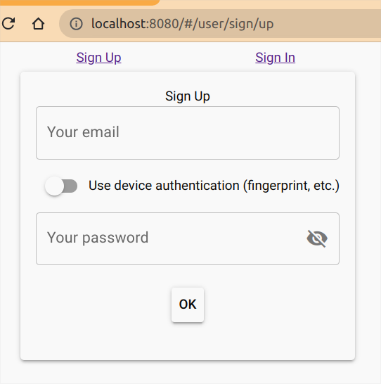

# WebAuthn API with PubKey Demo

An application that utilizes the WebAuthn API to implement secure user authentication using public key cryptography. All
backend data is stored in RDBMS (PostgreSQL or MariaDB/MySQL). Both the frontend and backend sides are developed using
vanilla JavaScript.

These npm packages are used to handle authentication data:

* [cbor](https://www.npmjs.com/package/cbor)
* [parse-cosekey](https://www.npmjs.com/package/parse-cosekey)

This application is a demo for the "[PublicKeyCredential in Web Apps](https://flancer32.com/e90f59acba45)" post.

## Install

```
$ git clone https://github.com/flancer64/demo-webauthn-pubkey.git
$ cd ./demo-webauthn-pubkey
$ npm install
```

## Setup

This app uses [Knex.js](https://knexjs.org/) to connect to PostgreSQL or MariaDB/MySQL databases.

### Create Database

PostgreSQL:

```
$ sudo -u postgres psql
...
postgres=# create user webauthn_pubkey password '...';
postgres=# create database webauthn_pubkey owner webauthn_pubkey;
postgres=# \q
```

MariaDB/MySQL:

```shell
root@host:/# mariadb
...
MariaDB [(none)]> CREATE DATABASE webauthn_pubkey;
MariaDB [(none)]> CREATE USER webauthn_pubkey@localhost IDENTIFIED BY '...';
MariaDB [(none)]> GRANT ALL PRIVILEGES ON webauthn_pubkey.* TO webauthn_pubkey@localhost;
MariaDB [(none)]> FLUSH PRIVILEGES;
```

## Configure the Application

Create a local configuration file and set up the connection to the database and the port to be listened to by the web
server:

```
$ cd ./cfg/
$ cp init.json local.json
$ nano local.json
```

Inside `local.json`, add the following configuration:

```json
{
  "@teqfw/db": {
    "client": "pg|mysql2",
    "connection": {
      "host": "127.0.0.1",
      "user": "...",
      "password": "...",
      "database": "..."
    }
  },
  "@teqfw/web": {
    "server": {
      "port": 8080
    }
  }
}

```

## Run the Application

```shell
$ npm run db-reset
$ npm start
```

Then go to http://localhost:8080 (or the configured port) and sign up as a new user with a platform authenticator (
see "[PublicKeyCredential in Web Apps](https://flancer32.com/e90f59acba45)"):



Try this demo with Android/iPhone/Desktop.
